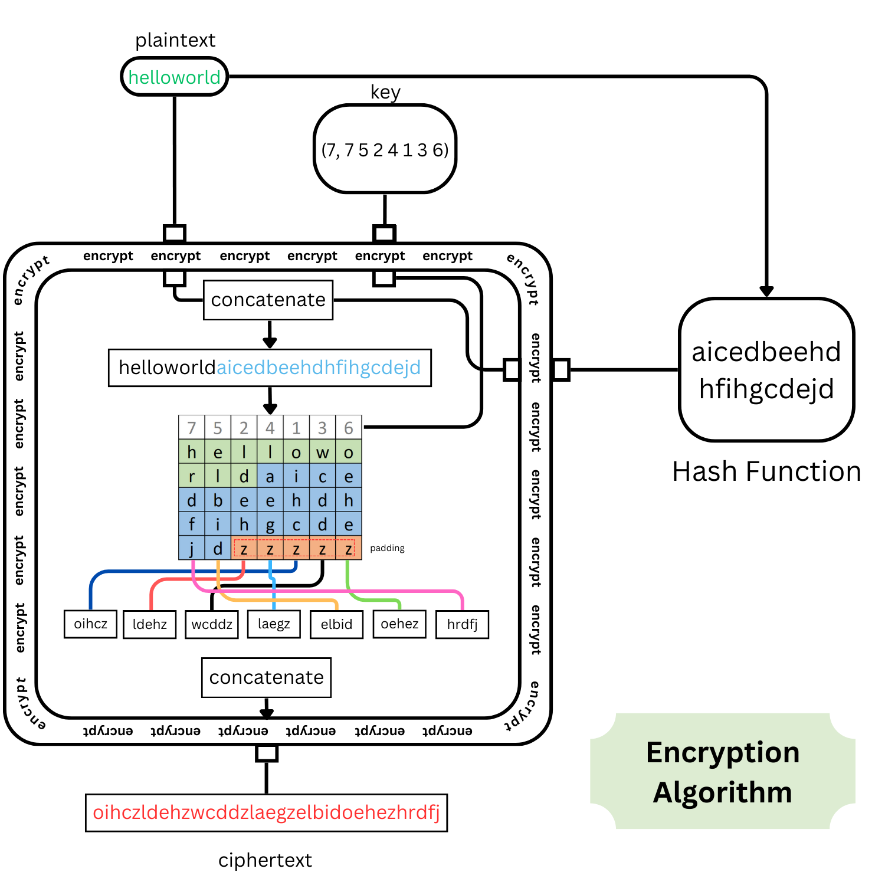
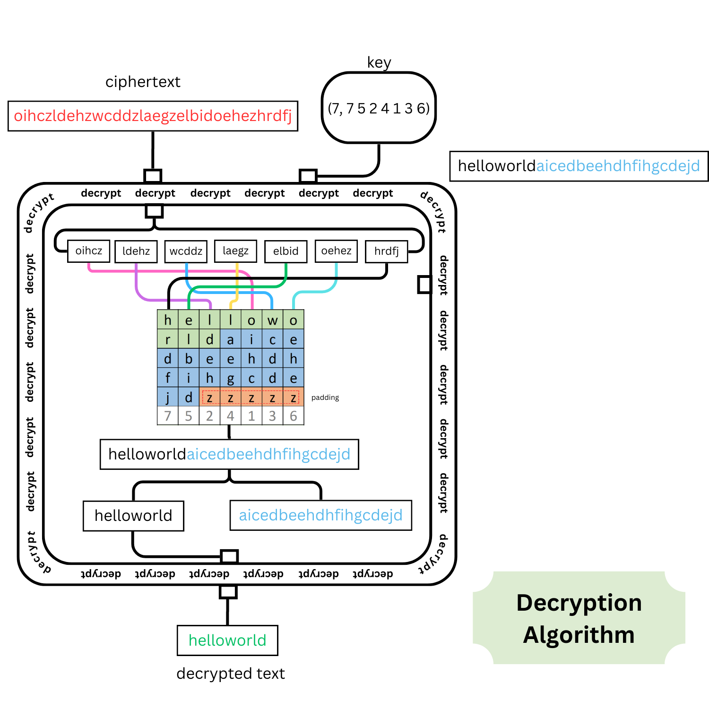

# <p style="text-align: center;"> CSE350/550: Network Security </p>
## <p style="text-align: center;"> Programming Assignment no. 1 - Project 2
**<p style="text-align: center;">Ankit Kumar(2021015) & Lakshay Chauhan(2021060)</p>**

### 1. Introduction
We were required to develop executable programs to encrypt, decrypt, and launch a brute-force attack to discover the key given a cipher text. The encryption and decryption of the plaintext and ciphertext must be done using a transposition algorithm. 

The whole code is essentially divided into 4 parts or functions.
- encrypt
- decrypt
- hash
- brute force  

### 2. Plaintext, Key and Ciphertext
#### Plaintext
The plaintext is a sequeunce of english alphabets {a,b, ...,x, y} without spaces. The length of the plaintext is not limited to any number but it is advised to keep it small enough to apply the bruteforce in meaningful time. The plaintext should also be long enough to make it meaningful to excrypt and such that length of plaintext is greater than the key length.

#### Key
Key can be considered as a tuple, where 1st element is a integer: length of the key and 2nd element of of the key is list of numbers consisting the sequence of column in which the text should be read and concatinate. The reverse order of this sequence should be used to decrypt the text.


#### Ciphertext
The Chiphertext is the encrypted text returned by the decrypt function. It is will longer than both, the initial plaintext and the hash. The chipher text is also padded with the letter '**z**'.

### 3. Encryption
This code implements a transposition cipher using Assembly (encrypt.asm) and C (transposition_cipher.c). A transposition cipher is a cryptographic method where character positions in plaintext are shifted according to a systematic approach to form ciphertext.

<div style="text-align:center"></div>  

- Assembly Code (encrypt.asm)  
The encrypt routine starts by saving registers and setting up local variables for the plaintext and key. The length of the plaintext and key are stored in `plaintext.len` and `key.len`. The plaintext is then aligned and padded with 'z' to match the length of the ciphertext.  
The key's length is used to calculate the length of the ciphertext(`ciphertext.len`). The transposition process involves rearranging the plaintext characters according to the key. Each character's position in the plaintext is shifted to a new position in the ciphertext. This rearrangement is based on the key values, ensuring each character from the plaintext is correctly positioned in the ciphertext. After the transposition, the ciphertext pointer `ciphertext.ptr` holds the final encrypted message.

- The main function in the C code checks if the operation is encrypt. It then processes the key and the plaintext, constructing an integer array for the key based on command-line arguments. A hash of the plaintext is concatenated with the original plaintext, and this modified plaintext is passed to the encrypt function along with its length and the key. The resulting ciphertext is printed, and any dynamically allocated memory is freed.

### 4. Decryption


<div style="text-align:center"></div>  

The decryption process in Assembly starts with standard register saving and input preparation, where ciphertext and key are loaded into designated variables. The significant part of the code revolves around accurately reversing the character positions used in the encryption process:

- Decryption Loop Initialization: The algorithm initializes the decryption loop by setting up variables like `column`, `cycles`, and `ciphertext.itr`. Particularly, `cycles` is calculated by dividing the length of the ciphertext (`ciphertext.strlen`) by the key length (`key.len`). It is how many times each key index is used across the ciphertext

- Character Positioning: The core decryption loop (`decrypt.loop`) iterates through each column (as denoted by column). For each column, it finds the corresponding index in the key and calculates the position in the plaintext where the current ciphertext character should be placed. This is achieved by adding the key length to the current index in a nested loop (```decrypt.plaintext.append.loop```), ensuring characters are placed correctly according to the transposition pattern.

- Padding Removal: After the repositioning of characters, the algorithm removes any padding characters (**'z'**) added during encryption. It works backwards from the end of the plaintext, decrementing the index until a non-padding character is encountered.

- In the C part of the code, the decryption process is initiated after checking for the 'decrypt' operation. It involves key processing(The key is constructed from command-line arguments and then used in the decryption function.), decryption function calling, and handling the decrypted output. The decrypt function is called with the ciphertext and key. After decryption, the algorithm separates the original plaintext and any hash value appended during encryption, demonstrating an additional layer of processing on the decrypted text.

### 5. Hash Function
Source: [http://www.cse.yorku.ca/~oz/hash.html](http://www.cse.yorku.ca/~oz/hash.html)  

The djb2 hash function, created by Daniel J. Bernstein, is known for its simplicity and effectiveness in hashing strings. It starts with an initial hash value of 5381 and iterates through each character of the input string. In each iteration, the hash value is updated using hash * 33 + c, where c is the current character's ASCII value.

```
    unsigned long
    hash(unsigned char *str){
        unsigned long hash = 5381;
        int c;
        while (c = *str++)
            hash = ((hash << 5)+ hash) ^ c; /* (hash * 33) ^ c */
        return hash;
    }
```

We have further modified the hashing algorithm to convert the numbers in the set {0, 1, 2, ..., 9} to english alphabets {a, b, c, ..., j}.


### 6. Brute Force Algorithm

The brute force decryption aims to decipher ciphertext by exhaustively trying different key lengths and their permutations, coupled with hash verification to validate the correctness of the decrypted text. 

The algorithm starts by iterating over potential key lengths from 1 to 9, the maximum defined in the project document. For each key length, it first checks if the ciphertext's length is a multiple of the key length. This step is crucial as it eliminates unnecessary computations for key lengths that are incompatible with the ciphertext length.

- Key Permutations and Decryption
Once a compatible key length is identified, the algorithm generates permutations of the key in the range `{1, ..., key-length}`. Each permutation is used to decrypt the ciphertext. This approach ensures that every possible key configuration is tested against the ciphertext.

- Hash Verification
An essential aspect of this brute force method is the use of hash verification to confirm the accuracy of the decrypted text. The decrypted text includes a hash, which is a 20-character alphabetic representation of an unsigned long value. This length is consistent as any shorter hash values are padded with leading zeroes.
To verify the decrypted text:

    - The hash is separated from the decrypted text.
    - The separated hash is converted back to its unsigned long form.
    - A new hash is generated from the plaintext portion of the decrypted text.
    - This newly generated hash is compared with the original hash extracted from the decrypted text.

- Successful Decryption  
If the hashes match, it indicates that the decrypted text is accurate, and the key used for decryption is correct. The algorithm then prints the plaintext, the hash, and the key to the console. This confirmation step is vital as it ensures that the brute force method does not falsely identify a key as correct based solely on the decryption output.

- Program Termination  
Upon successful decryption and verification, the program exits. If the hashes do not match, the algorithm continues to test other permutations and key lengths until the correct key is found or all possibilities are exhausted.


## Usage
The usage for the binary files and the supported commands can be found in the documentation file present in the dir [transposition_cipher](./transposition_cipher/README.md)
