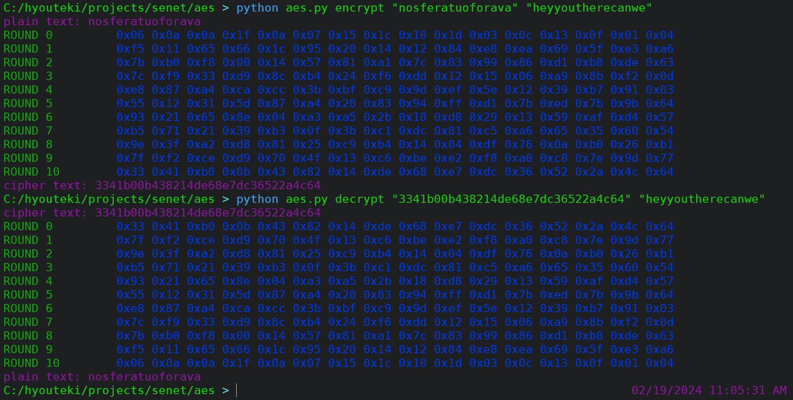

## Advanced Encryption Standard
- Encryption and decryption of a 128-bit plaintext using AES that uses keys of size 128 bit, and 10 rounds. 
- Verifications
  - Verify that the ciphertext when decrypted will yield the original plaintext.
  - Verify that the output of 1st encryption round is same as output of the 9th decryption round.
  - Verify that the output of 9th encryption round is same as output of the 1st decryption round.

