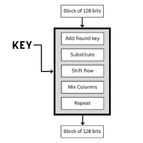

> CSE350/550: Network Security - Programming Assignment no. 2 
> (c) Ankit Kumar (2021015) & Lakshay Chauhan (2021060)

We were required to develop a program to encrypt (and similarly decrypt) a 128-bit plaintext using AES that uses keys
of size 128 bit, and 10 rounds.

The whole code is divided into various functions involving helper functions, aes helper functions, encryption and decryption functions.

## 1.	Initialization and S-Boxes: 
The constructor initializes the AES object with a 128-bit key (16 characters) and loads the substitution boxes (S-box for encryption and inverse S-box for decryption) from external files. These S-boxes are used for the byte substitution step.
## 2.	Utility Functions:

- `printHex` displays blocks of data in hexadecimal format.
- `multiplyWithinGaloisField` performs `multiplication` in the Galois field,essential for the mix columns step.
- `arrayToMatrix` and `matrixToArray` convert between linear arrays and 4x4 matrices, facilitating operations that work with AES state matrices.
## 3.	Key Expansion: 
- Before the actual encryption process begins, the input key undergoes an expansion using the `keyExpansion` method. This process generates a series of round keys from the initial key. Each round key is derived from the previous one through a combination of byte substitution (using the S-box), byte rotation, and XOR operations with a round constant.

## 4. Encrption:

 
1.	Initial Round
    - `AddRoundKey`: The first operation of the encryption process is to XOR the plaintext block with the initial round key (derived from the key expansion process).
2.	Main Rounds (1 to 9): Each of these rounds includes the following four steps
    - `SubBytes`: A non-linear substitution step where each byte is replaced with another according to the S-box.
    - `ShiftRows`: A transposition step where each row of the state is shifted cyclically a certain number of steps.
    - `MixColumns`: A mixing operation which operates on the columns of the state, combining the four bytes in each column.
    - `AddRoundKey`: Each byte of the state is XORed with the round key.  
The `mixColumns` step is not performed in the final (10th) round.
3.	Final Round (10th Round):
    - The final round includes the `SubBytes`, `ShiftRows`, and `AddRoundKey` steps, but omits the `MixColumns` step.

## 5. AES Decryption Steps: 
-Decryption follows the reverse order of encryption, applying the inverse of each operation. It's worth noting that the round keys are applied in reverse order during decryption.
1. Key Expansion:  
    - Similar to encryption, the decryption process begins with key expansion. The same key expansion function is used, but the round keys are used in reverse order.
2.	Initial Round:
    - AddRoundKey: The ciphertext is XORed with the last round key from the expanded key set.
3.	Main Rounds (1 to 9): Each of these rounds consists of the following steps, applied in reverse order compared to encryption:
    - `InvShiftRows`: The inverse of the `ShiftRows` step, rows are cyclically shifted in the opposite direction.
    - `InvSubBytes`: The inverse of the `SubBytes` step, where bytes are substituted back using the inverse S-box.
    - `AddRoundKey`: The round key is XORed with the state.
    - `InvMixColumns`: The inverse of the MixColumns step, unmixing the columns of the state.  
The `InvMixColumns` step is performed after the `AddRoundKey` step, which is a reversal from the encryption process and is not applied in the final (10th) round.
4.	Final Round (10th Round):
    - The final round includes `InvShiftRows`, `InvSubBytes`, and `AddRoundKey`, omitting the `InvMixColumns` step.

## 6. Testing and Verification: 

The program includes facilities to debug and print intermediate states in hexadecimal format, aiding in the verification of:
    - The correctness of the encryption by decrypting the ciphertext and comparing it to the original plaintext.
    - The equivalence of the output of the 1st encryption round with the output of the 9th decryption round, and vice versa for the 9th encryption round and the 1st decryption round.

## 7. Testcases

- **Testcase 1**:   
    - **Plaintext**: nosferatuoforava  
    - **Key**: heyyoutherecanwe  
    - **Ciphertext**: 3341b00b438214de68e7dc36522a4c64  
    - Encryption:
    
    - Decryption:
    
- **Testcase 2**:
    - **Plaintext**: ankitkumarkitkat  
    - **Key**: onepiece is real  
    - **Ciphertext**: 841ce41c7dfee8128986c2d554993453  
    - Encryption:
    
    - Decryption:
    
- **Testcase 3**: 
    - **Plaintext**: bijendranathjain  
    - **Key**: pretty cool prof  
    - **Ciphertext**: 4593374e10f0f25b80acc630f4675c63  
    - Encryption:
    
    - Decryption:
    
- **Testcase 4**:
    - **Plaintext**: network security  
    - **Key**: winter2024course  
    - **Ciphertext**: 2e9a6bf909a7198ded59af9c1fa5946e  
        - Encryption:
        
        - Decryption:
        